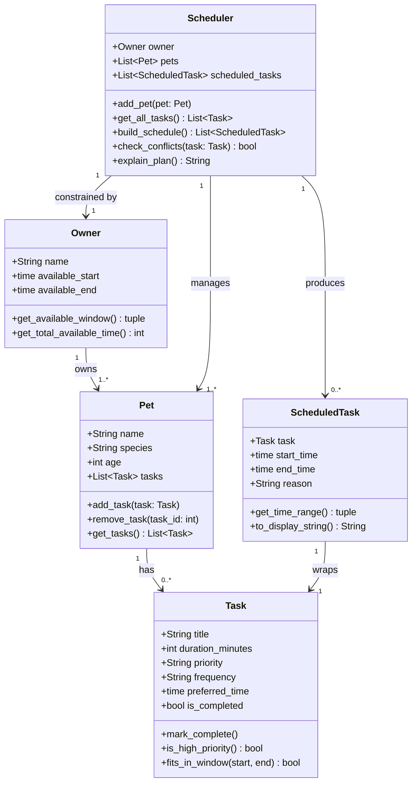

<!--
DESIGN NOTES

ScheduledTask as a separate class:
  Kept because it cleanly separates what a task is (Task) from when it runs today (ScheduledTask).
  This makes explain_plan() and the UI display much simpler — the Task holds the definition,
  the ScheduledTask holds the placement.

Owner as its own class:
  Kept because the scheduler needs time constraints to be first-class, not buried in the UI.
  available_start and available_end are the concrete inputs the scheduling algorithm depends on.

Owner.preferences removed:
  Too vague to model cleanly at this stage. The time window (available_start/available_end)
  is the concrete constraint that actually matters for scheduling. Preferences can be added
  later if specific preference types are identified.

Pet.owner back-reference removed:
  Unnecessary since Scheduler already manages both Owner and Pets. Adding a back-reference
  from Pet to Owner would create a circular dependency with no clear benefit.

Scheduler is the integration point:
  By design, Scheduler is the only class that touches everything — it reads Owner constraints,
  collects Tasks from all Pets, and produces ScheduledTasks. All scheduling logic lives here.
-->
