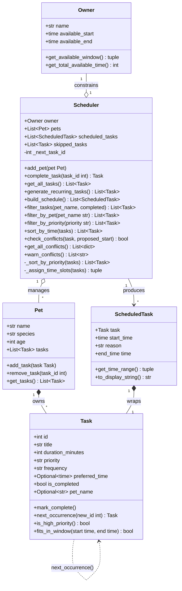

<!--
DESIGN NOTES

ScheduledTask replaces DailyPlan:
  The initial design had a single DailyPlan holding the full day's output.
  Replaced by individual ScheduledTask objects — one per placed task — so the
  UI can render per-task reasoning and time slots independently. end_time is a
  computed @property (derived from start_time + duration), not a stored field.

Task.pet_name added:
  Once Scheduler.get_all_tasks() flattens all pets into one list, the pet
  association is lost. pet_name is stamped onto the Task by Pet.add_task() so
  the scheduler and UI can always display ownership without a reverse lookup.

Task.next_occurrence() — self-referential:
  Recurring tasks (daily/weekly) need a fresh copy when marked complete.
  next_occurrence() lives on Task because only Task knows its own frequency.
  Scheduler.complete_task() calls it and re-registers the result with the pet.

Scheduler._next_task_id:
  Private counter starting at 1000 to avoid ID collisions with user-created
  tasks when auto-generating next occurrences for recurring tasks.

skipped_tasks added to Scheduler:
  The greedy algorithm silently dropped tasks that didn't fit. skipped_tasks
  surfaces them so the UI can warn the owner rather than hiding the overflow.

explain_plan() removed:
  The per-task reason field on ScheduledTask already covers this. A separate
  method returning a monolithic string would duplicate that logic and be harder
  to test.

Relationships upgraded to composition where appropriate:
  Pet *-- Task: Pet owns its tasks' lifecycle (remove_task deletes them).
  ScheduledTask *-- Task: ScheduledTask wraps exactly one Task and cannot
  exist without it. Scheduler o-- Pet: Scheduler manages pets but does not
  create or destroy them (aggregation, not composition).
-->
